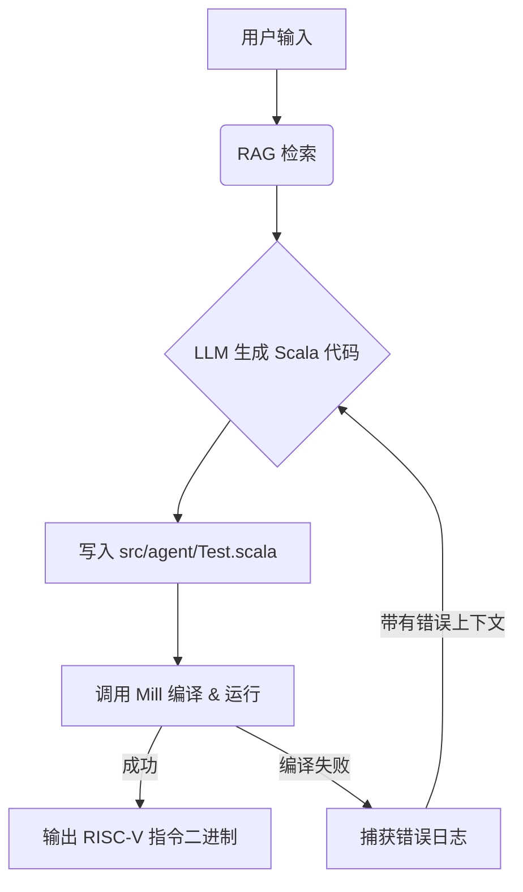

# RVProbe Agent: 智能 RISC-V 验证指令生成器

RVProbe Agent 是一个基于大语言模型（LLM）的自动化验证生成工具。它能够将自然语言描述的验证意图转化为严格的 Scala DSL 代码，进而利用底层的约束求解器（SMT）生成高质量的 RISC-V 指令序列。

本项目旨在解决处理器验证中"从测试意图到测试用例"的最后一公里问题，通过 RAG（检索增强生成）和编译器反馈闭环，实现了高成功率的自动化生成。

---

## 🌟 核心特性

- **自然语言接口**: 支持用英语直接描述复杂的指令约束（如 "Generate 100 ADDI instructions with RAW dependencies"）。
- **RAG 增强生成**: 内置针对 RISC-V 验证优化的检索引擎，能够根据指令类型自动召回相关的 DSL API 文档和设计模式。
- **自我修复闭环 (Self-Correction)**: Agent 不仅负责生成代码，还负责"编译与调试"。如果生成的 Scala 代码无法通过编译（如类型错误、缺少隐式参数），Agent 会自动分析编译器报错日志并进行代码修复。
- **高可靠性**: 不同于直接生成汇编指令（Direct LLM），Agent 生成的是**约束逻辑**。指令的合法性由底层形式化验证工具（Z3/SMT Solver）保证，从根本上消除了非法指令的产生。

## 🏗️ 技术架构

系统采用 **Python 控制平面 + Scala 数据平面** 的双层架构：

### 1. 控制平面 (Python)
- **LangGraph**: 管理 Agent 的状态机流转（检索 -> 生成 -> 执行 -> 评估 -> 修复）。
- **ChromaDB**: 向量数据库，存储 DSL 文档、代码片段和常见的验证 Pattern。
- **RAG 策略**: 
    - **指令感知检索**: 当检测到特定指令（如 `SLLI`）时，强制召回其特有的约束函数文档（如 `shamtdRange`）。
    - **模式匹配**: 根据关键词（如 "dependency", "hazard"）召回对应的代码模板（如 RAW 依赖链模板）。

### 2. 数据平面 (Scala / Mill)
- **Mill Build Tool**: 负责编译生成的 `Test.scala` 并执行测试生成。
- **RVProbe DSL**: 一套基于 Scala 3 的领域特定语言，利用了 Scala 强大的类型系统：
    - **上下文函数 (Context Functions)**: 使用 `Index ?=> InstConstraint` 等高级特性，实现这一点的自动化生成是本项目的难点之一。
    - **隐式参数 (Implicits)**: 自动处理指令生成所需的上下文环境。

### 3. 工作流



## 🛠️ 安装与配置

### 环境要求
- **Python**: 3.10+
- **构建工具**: [Mill](https://mill-build.com/mill/Intro_to_Mill.html) (或通过 Nix 环境)
- **依赖管理**: `pip` 或 `uv`

### 快速开始

1. **安装 Python 依赖**
   ```bash
   cd rvprobe/agent
   pip install -r requirements.txt
   # 或者使用 uv
   uv sync
   ```

2. **配置环境变量**
   填入 API Key: 编辑 .env 文件，设置 OPENAI_API_KEY 等

3. **初始化数据库** (可选)
   如果是首次运行，Agent 会自动建立为了 RAG 检索所需的 ChromaDB 索引。

## 🚀 使用指南

### 命令行模式
直接描述你的验证需求：

```bash
# 简单示例
python agent.py "Generate 10 ADDI instructions with rd in range 1-10"

# 复杂约束示例 (Agent 会检索相关 Pattern)
python agent.py "Generate 50 instructions mixing ADDI and SUB with Read-After-Write (RAW) data dependencies"
```

### Python API 调用
适合集成到更大的测试流程中：

```python
from agent import run_agent

result = run_agent("Generate 20 SLLI instructions for RV64I")

if result['is_success']:
    print(f"Generated Instructions:\n{result['instructions']}")
else:
    print(f"Failed after {result['retry_count']} retries.")
```

## 📊 Benchmark (性能评估)

本项目包含一个完整的 Benchmark 框架，用于量化评估 Agent 的性能。

### 对比方案
- **Agent (本项目)**: RAG + 编译器反馈闭环 + SMT 求解。
- **Direct LLM**: 让 LLM 直接输出 RISC-V 汇编指令（无验证，无反馈）。

### 运行测试
```bash
# 运行完整测试套件 (包含简单、中等、复杂共 15 个测试用例)
python -m benchmark.benchmark
```

### 测试指标
- **Success Rate**: 代码能否成功编译并生成指令。
- **Validity**: 生成的指令是否符合用户约束（通过解析器验证）。
- **Complexity**: 支持的约束复杂度（如 Cross-instruction 约束）。

## 📂 目录结构

```
rvprobe/agent/
├── agent.py               # 主程序入口 & LangGraph 定义
├── rag.py                 # RAG 检索引擎 & 向量库管理
├── indexer.py             # 文档索引构建工具
├── benchmark/             # Benchmark 评测框架
│   ├── test_suite/        # 测试用例定义 (TC-Sxx, TC-Mxx, TC-Cxx)
│   ├── runners/           # 执行器实现 (AgentRunner vs DirectRunner)
│   └── analysis/          # 结果分析与报告生成
├── chromadb/              # 向量数据库存储 (自动生成)
├── models/                # 本地 Embedding 模型缓存
└── requirements.txt       # 项目依赖
```

## 💡 关键技术点与技巧

1.  **Scala 3 类型系统的 LLM 适配**:
    针对 Scala 3 的 `given` (隐式参数) 和 `?=>` (上下文函数)，在 Prompt 中显式提供了这些特性的 Examples，帮助 LLM 理解何时通过闭包延迟求值，何时直接求值。

2.  **错误驱动的 Prompt Engineering**:
    在重试阶段，不仅将错误日志（Error Log）传回给 LLM，还会根据错误类型（如 "value isAddi is not a member"）自动检索补充相关的 API 文档，提高修复成功率。

3.  **确定性与随机性的平衡**:
    Agent 生成的是**约束**而非**指令**。这意味着 LLM 只需要描述"规则"（例如寄存器范围），具体指令的随机化（Randomization）和合法化（Legalization）交给底层的 `rvprobe` 求解器完成，这种分工大大降低了 LLM 的幻觉风险。
