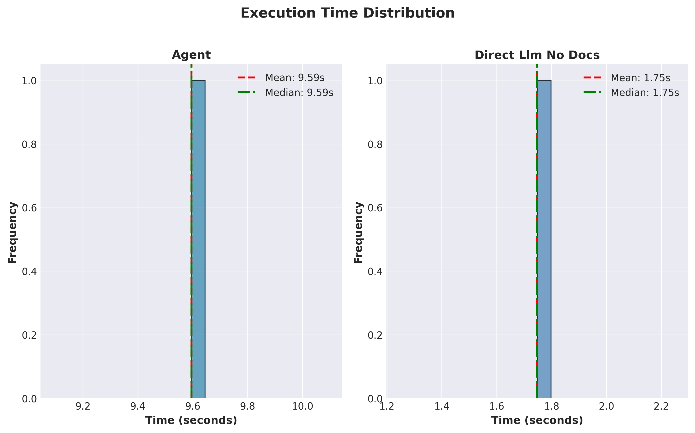
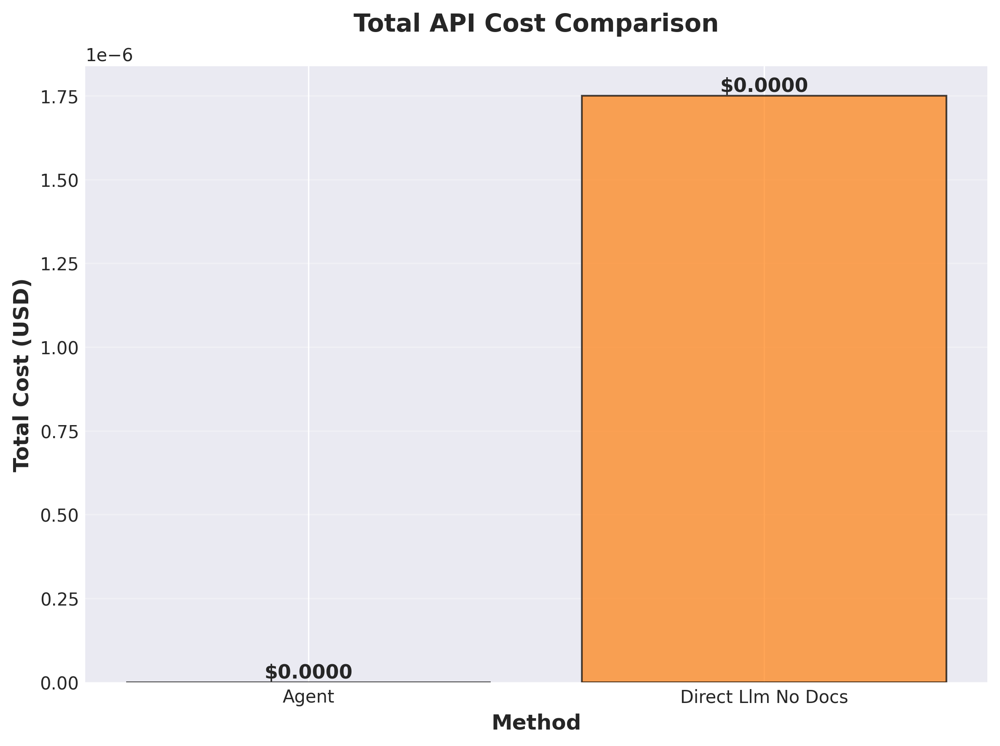
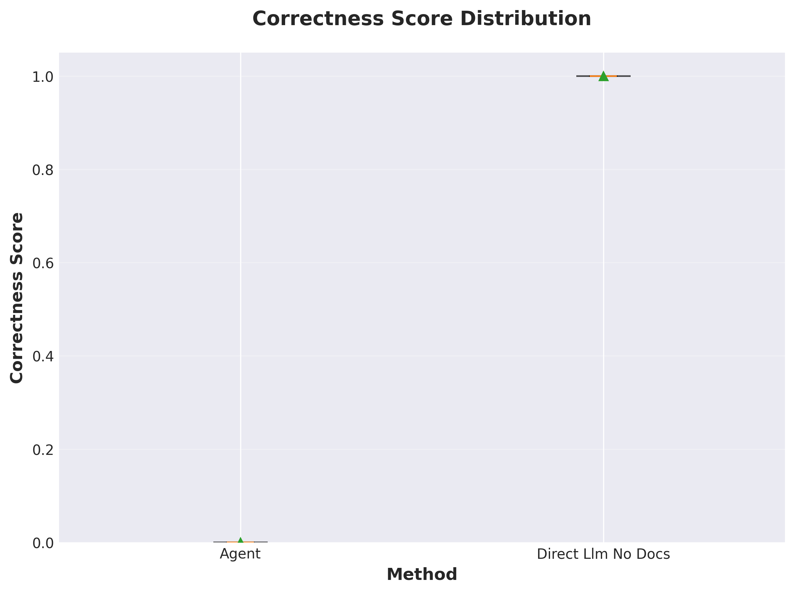
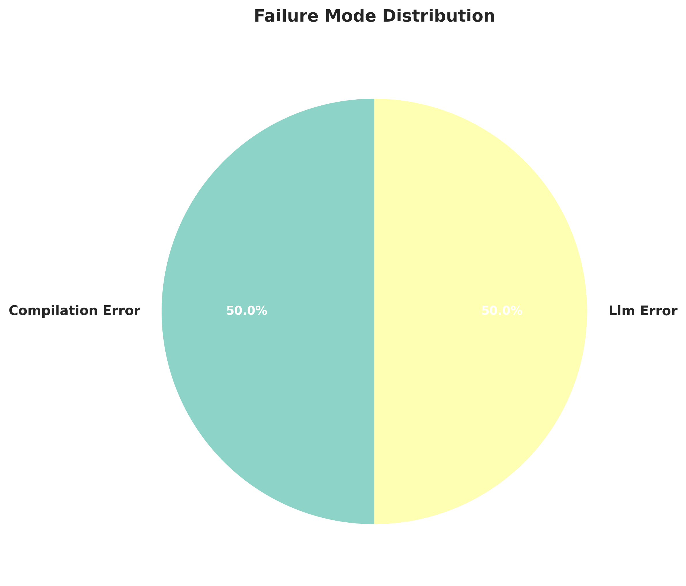

# RVProbe Agent Benchmark Report

**Generated**: 2026-02-05 17:28:35

**Configuration:**
- Model: gpt-4o
- Temperature: 0.0
- Timeout: 300s
- Total Results: 2

## Table of Contents

1. [Executive Summary](#executive-summary)
2. [Method Comparison](#method-comparison)
3. [Results by Difficulty Level](#results-by-difficulty-level)
4. [Performance Analysis](#performance-analysis)
5. [Failure Analysis](#failure-analysis)
6. [Recommendations](#recommendations)
7. [Visualizations](#visualizations)

---

## Executive Summary

### Agent

- **Overall Success Rate**: 0/1 (0.0%)
- **Average Execution Time**: 12.940s
- **Total API Cost**: $0.0000
- **Average Correctness Score**: 0.000
- **Average Retry Count**: 3.00

### Direct Llm No Docs

- **Overall Success Rate**: 0/1 (0.0%)
- **Average Execution Time**: 0.035s
- **Total API Cost**: $0.0000
- **Average Correctness Score**: 0.000

## Method Comparison

| Metric | Agent | Direct Llm No Docs | Winner |
|--------|--------|--------|--------|
| Success Rate (%) | 0.0 | 0.0 | **Agent** |
| Avg Time (s) | 12.940 | 0.035 | **Direct Llm No Docs** |
| Total Cost ($) | $0.0000 | $0.0000 | **Agent** |
| Avg Correctness | 0.000 | 0.000 | **Agent** |

## Results by Difficulty Level

### Simple Tests

| Method | Success Rate | Avg Time (s) | Avg Correctness |
|--------|--------------|--------------|-----------------|
| Agent | 0.0% (0/1) | 12.940 | 0.000 |
| Direct Llm No Docs | 0.0% (0/1) | 0.035 | 0.000 |

## Performance Analysis

### Agent

**Execution Time Statistics:**

- Mean: 12.940s
- Median (P50): 12.940s
- P95: 12.940s
- P99: 12.940s
- Range: [12.940s, 12.940s]
- Std Dev: 0.000s

**Correctness Score Statistics:**

- Mean: 0.000
- Median: 0.000
- Range: [0.000, 0.000]

### Direct Llm No Docs

**Execution Time Statistics:**

- Mean: 0.035s
- Median (P50): 0.035s
- P95: 0.035s
- P99: 0.035s
- Range: [0.035s, 0.035s]
- Std Dev: 0.000s

**Correctness Score Statistics:**

- Mean: 0.000
- Median: 0.000
- Range: [0.000, 0.000]

## Failure Analysis

### Agent

**Total Failures**: 1/1 (100.0%)

**Failure Modes:**

- Compilation Error: 1 (100.0%)

**Failed Test Cases:**

- `TC-S01` (simple) - compilation_error

### Direct Llm No Docs

**Total Failures**: 1/1 (100.0%)

**Failure Modes:**

- Llm Error: 1 (100.0%)

**Failed Test Cases:**

- `TC-S01` (simple) - llm_error

## Recommendations

### When to Use Each Method

**For Maximum Accuracy**: Use **Agent**
- Success rate: 0.0%
- Average correctness: 0.000

**For Fastest Execution**: Use **Direct Llm No Docs**
- Average time: 0.035s

**For Lowest Cost**: Use **Agent**
- Total cost: $0.0000

### General Recommendations

- Direct Llm No Docs is 366.7× faster, making it suitable for time-sensitive applications
- Consider using faster method for simple cases and verified method for complex constraints
- Implement timeout mechanisms for production use
- Monitor API costs in production environments

## Visualizations

### Success Rate by Difficulty

### Execution Time Distribution

### API Cost Comparison

### Correctness Score Distribution

### Failure Mode Distribution

---

*Report generated by RVProbe Benchmark Framework*
